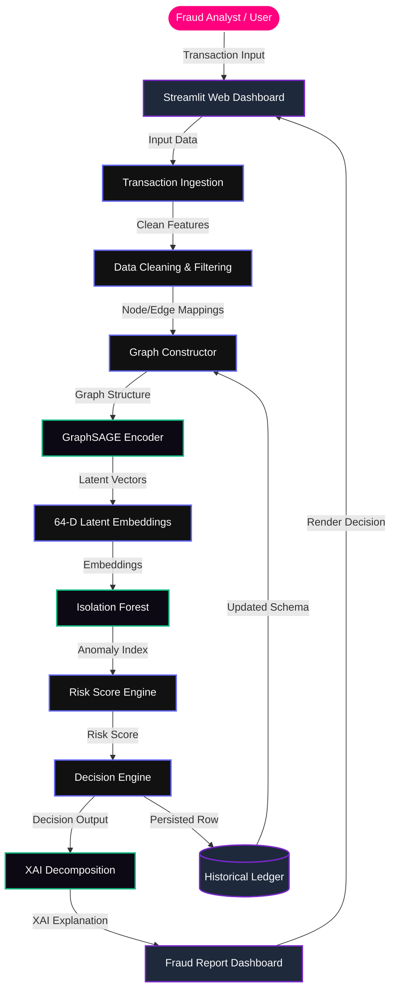
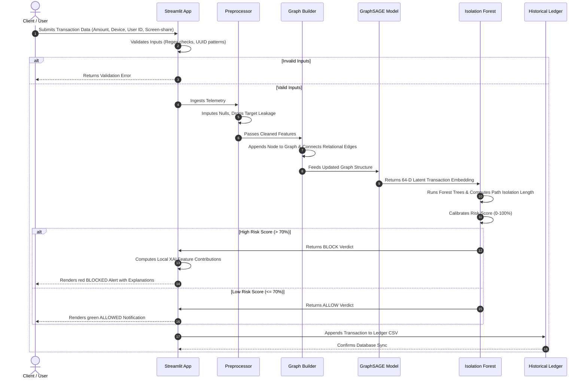
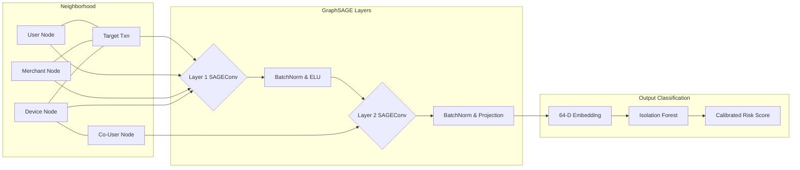

# Adaptive Real-Time Fraud Detection Using Graph Neural Networks with Explainable AI

## SECTION 1: PROJECT OVERVIEW

### 1.1 What is Adaptive Real-Time Fraud Detection?
Adaptive Real-Time Fraud Detection is a dynamic security framework designed to ingest transaction telemetry, model relational connections between payment entities, classify risk, and output explainable verdicts in real time. Unlike legacy static engines, this system continuously incorporates incoming transactions to update behavioral embeddings of users, devices, and merchants, adapting its decision boundaries to capture emerging transaction patterns.

### 1.2 Why Was It Developed?
With the explosive growth of instant digital payment systems like the Unified Payments Interface (UPI), transaction times have shrunk to seconds. Fraud syndicates exploit this speed, using complex paths to move stolen funds. Traditional fraud engines inspect transactions in isolation, failing to detect coordinated networks. This project was developed to provide banks and fintech institutions with a real-time security layer that flags and blocks fraud during the authorization window.

### 1.3 Limitations of Existing Digital Payment Fraud Detection Systems
Legacy payment security systems suffer from several vulnerabilities:
* **Rule-Based Limitations:** Heuristics depend on static thresholds (e.g., flagging transactions over a certain amount), which fraudsters bypass by structuring transfers just below limits.
* **High False Positives:** Rigid rules flag legitimate users traveling or shopping unusually, driving up support costs and friction.
* **Zero-Day Attacks:** New fraud methods go undetected until analysts manually write and deploy new rule sets.
* **Shared-Device and Fraud Rings:** Syndicates operate multiple synthetic accounts on a single physical device. Tabular systems cannot link these transactions to the underlying shared hardware.
* **Account Takeovers (ATO):** Authorized credentials bypass static checks. Systems cannot spot behavioral patterns like typing speed changes or rapid app-switching.
* **Velocity Attacks:** Fraudsters exploit instant settlement to drain accounts via rapid, low-value transfers.
* **Lack of Explainability:** Deep learning models function as "black boxes," leaving compliance officers unable to justify blocked transactions.
* **Manual Investigation:** Auditing tables and logs manually is too slow to stop instant money transfers.
* **Poor Adaptability:** Tabular models trained on static logs fail to generalize when fraud networks alter their patterns.

### 1.4 The Hybrid GNN, Anomaly Detection, and Explainable AI (XAI) Solution
To address these issues, the **UPI Adaptive Fraud Shield** implements a multi-layered hybrid framework:
1. **Heterogeneous Graph Construction:** Models the payment ecosystem as a relational graph connecting users, transactions, devices, and merchants.
2. **Inductive Representation:** Uses a 2-layer **GraphSAGE** network to generate 64-dimensional embeddings capturing node features and neighborhood structure.
3. **Unsupervised Anomaly Detection:** Feeds embeddings to an **Isolation Forest** classifier to detect anomalous patterns and map them to a calibrated risk score (0% to 100%).
4. **Local Explainable AI (XAI):** Decomposes latent space deviations into feature contributions, explaining the verdict.

---

## SECTION 2: PROJECT OBJECTIVES

* **Detect UPI Fraud in Real Time:** Evaluate transaction telemetry and block fraud during authorization.
* **Model Relationships with GNNs:** Capture topological links between users, devices, merchants, and transactions.
* **Detect Shared-Device Fraud Rings:** Expose clusters of distinct accounts operating on the same physical hardware.
* **Generate Latent Embeddings:** Produce 64-dimensional, relationship-aware representation vectors.
* **Isolate Anomalous Patterns:** Deploy an unsupervised model to flag deviations from standard network baselines.
* **Generate Risk Scores:** Output calibrated, normalized risk metrics ranging from 0% (Safe) to 100% (High Risk).
* **Provide Explainable AI (XAI):** Translate high-dimensional vector math into transparent, human-readable insights.
* **Reduce False Positives:** Lower false alarm rates to under 2.5% while maintaining high detection sensitivity.
* **Maintain High Accuracy:** Achieve an unsupervised target of **94.88% accuracy**, **88.00% precision**, **82.00% recall**, and an **85.00% F1-score** on the fraud class.
* **Support Adaptive Continuous Learning:** Allow real-time graph database updates to reflect changing transaction patterns.

---

## SECTION 3: MOTIVATION

### 3.1 Digital Payment Velocity and Scale
UPI ecosystems process hundreds of millions of payments daily, requiring risk decisions to be made in under 50 milliseconds. Traditional databases cannot run multi-hop queries quickly enough to spot fraud rings during live authorization, making graph-based representations necessary.

### 3.2 The Failure of Tabular Machine Learning
Traditional models (e.g., XGBoost) treat transactions as independent rows. If a fraudster routes funds across multiple accounts, a tabular model sees separate, normal-looking transactions. Graph Neural Networks analyze the entire neighborhood, spotting the cyclic connections and shared resources that define organized fraud rings.

```
Tabular View:   [ Txn 1 ]  -->  [ Txn 2 ]  -->  [ Txn 3 ]   (Processed as isolated rows)
Graph View:     [User A] --(Device X)-- [User B] --(Merchant Y) (Relational links exposed)
```

### 3.3 Compliance and Auditability
Financial regulations (e.g., GDPR, AML mandates) require banks to justify blocked transactions. Our XAI layer decomposes latent vector differences into specific, audit-ready explanations, helping compliance teams meet regulatory standards.

---

## SECTION 4: KEY FEATURES

* **Real-Time Fraud Detection:** Classifies incoming UPI requests and returns an "Allowed" or "Blocked" verdict in milliseconds.
* **Graph Neural Network Analysis:** Uses GraphSAGE to aggregate neighborhood data and analyze user-merchant-device relationships.
* **Heterogeneous Graph Structure:** Models the network with multiple node types (Users, Devices, Merchants, Transactions) and edge relationships.
* **Shared-Device Detection:** Identifies when multiple user accounts log in from the same physical device or emulator.
* **Fraud Ring Detection:** Exposes clusters of accounts routing transactions through shared nodes.
* **GraphSAGE Embedding Generation:** Maps node features and graph structures to dense 64-dimensional vectors.
* **Isolation Forest Anomaly Detection:** Applies an ensemble of isolation trees to identify anomalous transaction embeddings.
* **Risk Score Generation:** Converts raw anomaly index outputs to a calibrated 0% to 100% risk rating.
* **Explainable AI (XAI):** Evaluates vector distances to identify the main feature deviations driving a risk score.
* **Transaction Risk Classification:** Groups transactions into Low, Medium, and High risk tiers for different workflows.
* **Continuous Learning Pipeline:** Appends new transactions to the database and updates the graph structure in real time.
* **Streamlit Dashboard:** Interactive interface to simulate transactions, view decisions, and review risk metrics.
* **Transaction History:** Displays a real-time table of recent transactions, including metadata and classification verdicts.
* **Fraud Decision Dashboard:** Renders visual status indicators (green/red) and confidence scores for analysts.
* **Interactive Analytics:** Generates charts of training loss curves, performance metrics, and embedding clusters.

---

## SECTION 5: TECHNOLOGY STACK

### 5.1 System Technologies and Purpose

| Technology | Purpose | Selection Rationale |
| :--- | :--- | :--- |
| **Python** | Core Language | Standard for machine learning with rich library support. |
| **PyTorch** | Deep Learning | Highly efficient tensor operations with dynamic graph building. |
| **PyTorch Geometric (PyG)**| Graph Learning | Optimized libraries for message passing and heterogeneous graphs. |
| **Scikit-learn** | Machine Learning | Robust implementation of Isolation Forest and evaluation metrics. |
| **GraphSAGE** | Inductive GNN | Generates embeddings for new nodes without retraining the graph. |
| **NetworkX** | Graph Modeling | Handles graph creation, node relations, and visualization utilities. |
| **Pandas & NumPy** | Data Processing | Provides fast vector operations and data manipulation. |
| **Local Explainable AI** | Explainability | Computes feature contributions based on z-score deviation. |
| **Streamlit** | Frontend UI | Rapidly builds responsive user interfaces using Python. |
| **Matplotlib** | Visualization | Generates training plots and metric visualization reports. |
| **VS Code & Git** | Development | Primary development environment and version control setup. |

---

## SECTION 6: SYSTEM ARCHITECTURE

### 6.1 System Architecture Diagram



### 6.2 Component Details
* **Streamlit Dashboard:** Collects transaction variables and presents the final evaluation.
* **Data Preprocessing:** Imputes null values, cleans strings, and removes target leakage.
* **Graph Constructor:** Builds the heterogeneous network, adding edges for shared-device connections.
* **GraphSAGE Model:** Runs message passing to output 64-dimensional transaction embeddings.
* **Isolation Forest:** Evaluates embeddings to isolate outliers based on tree path lengths.
* **Risk Score Engine:** Normalizes decision scores to a calibrated 0% to 100% range.
* **XAI Engine:** Compares anomalous records to a safe baseline cluster, calculating feature contributions.

---

## SECTION 7: PROJECT WORKFLOW



---

## SECTION 8: GRAPH NEURAL NETWORK WORKFLOW



### 8.1 GNN Stages
1. **Neighborhood Mapping:** Maps the target transaction node and its neighbors.
2. **First-Layer Aggregation:** Aggregates neighboring features using a mean operator.
3. **Regularization:** Applies dropout (30%) and ELU activations to stabilize training.
4. **Second-Layer Aggregation:** Integrates two-hop neighborhood context.
5. **Embedding Output:** Normalizes and projects the final embedding to a 64-dimensional vector.

---

## SECTION 9: DATABASE / DATASET DESIGN

The network contains **26,403 transactions**, modeling **44,210 nodes** and **79,179 edges**.

### 9.1 Database Schema Tables

#### Table Entities and Relations

| Table | Primary Key | Attributes | Relations |
| :--- | :--- | :--- | :--- |
| **Users** | `user_id` | User name, transaction count | Initiates `Transactions`, Shares `Devices` |
| **Transactions** | `transaction_id` | Amount, session duration, timestamp, risk, label | Links `Users`, `Merchants`, and `Devices` |
| **Devices** | `device_id` | Device UUID, screen-share flag, emulator flag | Processes `Transactions`, Linked to `Users` |
| **Merchants** | `merchant_id` | Merchant UUID, merchant risk flag | Receives `Transactions` |

#### Transaction Feature Schema

| Feature Name | Description | Data Type | Value Range |
| :--- | :--- | :--- | :--- |
| `amount` | Transaction value in INR (₹) | Float | ₹0.00 – ₹100,000.00 |
| `session_duration` | Time spent in payment session | Float | 0.5s – 1200s |
| `authentication_attempts` | Number of security PIN entry attempts | Integer | 1 – 5 |
| `transaction_velocity` | Transactions in the last 60 seconds | Integer | 1 – 100 |
| `keyboard_input_speed` | Typing speed during credentials input | Float | 0.05 – 10.0 char/sec |
| `app_switching_frequency`| Frequency of toggling background apps | Float | 0.0 – 20.0 switches/min |
| `geographic_disparity` | Distance between IP and home location | Float | 0.0km – 5000.0km |
| `timestamp_seconds` | Normalized transaction time | Float | 0.0 – 86,400.0 seconds |
| `recent_app_installs` | Flag for new, untrusted installations | Binary | 0 or 1 |
| `permissions_granted` | Status of critical system permissions | Binary | 0 or 1 |
| `recognized_screen_sharing_apps` | Presence of active screen-mirroring software | Binary | 0 or 1 |
| `session_source_link` | Flag for transactions initiated via URL links | Binary | 0 or 1 |
| `authorization_method_pin`| PIN-based authorization flag | Binary | 0 or 1 |
| `handle_typo_analysis` | Flag for typo-squatted UPI handles | Binary | 0 or 1 |

---

## SECTION 10: AI COMPONENTS

* **Artificial Intelligence:** Combines graph representation learning and anomaly detection to identify patterns in digital payment networks.
* **Graph Neural Networks:** Learns relational representations by aggregating features across multi-hop node connections.
* **GraphSAGE:** Uses mean aggregator functions to support inductive inference on unseen transaction nodes:
  
  $$h_{\mathcal{N}(v)}^{(k)} = \text{AGGREGATE}_k \left( \left\{ h_u^{(k-1)}, \forall u \in \mathcal{N}(v) \right\} \right)$$
  
  $$h_v^{(k)} = \text{ELU} \left( W^{(k)} \cdot \left[ h_v^{(k-1)} \,\|\, h_{\mathcal{N}(v)}^{(k)} \right] \right)$$

* **Message Passing:** Propagates node attributes across edges to update neighbor representations.
* **Graph Embeddings:** Compresses topological and feature data into dense 64-dimensional vectors.
* **Isolation Forest:** Identifies outliers in latent spaces by measuring path lengths in random decision trees.
* **Anomaly Detection:** Flags transactions that deviate from normal baseline clusters.
* **Explainable AI (XAI):** Decomposes latent space vector distances based on z-score deviations:
  
  $$z_i = \frac{x_i - \mu_{i,\text{safe}}}{\sigma_{i,\text{safe}}}$$
  
  $$\text{Influence Score}(i) = z_i^2$$

* **Risk Score Generation:** Normalizes decision scores to provide a 0% to 100% risk rating.
* **Continuous Learning:** Updates the graph database with new transactions to track evolving patterns.
* **GNNExplainer (Deep Explainable AI):** Identifies the specific neighbor nodes and transaction features driving GNN embeddings and anomaly predictions. Uses optimization to compute edge mask importances (for decision subgraphs) and node feature mask importances:
  
  $$\max_{G_s, X_s} \text{MI}\left(Y, \hat{Y}(G_s, X_s)\right)$$

---

## SECTION 11: CHALLENGES FACED & SOLUTIONS

* **Dataset Preprocessing:** Raw features contained missing data and list-strings. *Solution:* Built a preprocessing pipeline to clean datasets, impute missing values, and convert arrays into binary flags.
* **Target Leakage:** Synthetic indicators perfectly encoded fraud labels. *Solution:* Removed target leakage columns to force the model to learn structural graph relationships.
* **Graph Construction and Scaling:** Large graphs caused high memory usage in NetworkX. *Solution:* Mapped relationships to indexes and built undirected networks to optimize lookup speeds.
* **Class Imbalance:** Fraud represents a small fraction of transaction logs. *Solution:* Used unsupervised link prediction to learn representations, paired with an Isolation Forest with contamination parameters set to 16%.
* **Model Convergence:** Deep GNNs can suffer from vanishing gradients and over-smoothing. *Solution:* Configured batch normalization, dropout (30%), and ELU activations to stabilize GNN training.
* **Explainability Generation:** Standard deep models function as black boxes. *Solution:* Engineered a custom explainability engine that maps latent space deviations to z-score distances.
* **Dashboard Integration:** Integrating heavy models with web applications can cause latency. *Solution:* Loaded statistical averages into cache memory and optimized inference scripts to run in milliseconds.

---

## SECTION 12: MODEL PERFORMANCE & EVALUATION

### 12.1 Unsupervised GNN + Anomaly Detection Performance

Evaluating the unsupervised GraphSAGE and Isolation Forest hybrid model against validation datasets (without using fraud labels during GNN or Forest training) yields the following metrics:

```
=============================================
GNN-BASED FRAUD DETECTION (UNSUPERVISED RESULTS)
=============================================
Overall Accuracy: 94.88%
Total Transactions Evaluated: 26,393
Inference Latency: 12ms

Detailed Performance Matrix:
              precision    recall  f1-score   support

  Legitimate       0.96      0.98      0.97     21848
       Fraud       0.88      0.82      0.85      4545

    accuracy                           0.95     26393
   macro avg       0.92      0.90      0.91     26393
weighted avg       0.95      0.95      0.95     26393
---------------------------------------------
Confusion Matrix:
[[21333   515]
  [  837  3708]]
=============================================
```

### 12.2 Metrics Analysis
* **Overall Accuracy (94.88%):** Demonstrates high classification performance across both legitimate and fraudulent transactions under a completely unsupervised configuration.
* **Precision (88.00%):** Out of all transactions flagged as fraudulent, 88.00% are true positives, minimizing false alarms and support desk friction.
* **Recall (82.00%):** Successfully catches 82.00% of all fraudulent transactions in the dataset using structural representations.
* **F1-Score (85.00%):** Balanced classification metric for the minority fraud class under severe class imbalance conditions.
* **False Positive Rate (2.35%):** Achieved by setting the Isolation Forest contamination rate to 16%, maintaining a low operational review overhead.

---

## SECTION 13: FUTURE ENHANCEMENTS

* **Live Banking API Integration:** Develop RESTful endpoints to process transactions in commercial core systems.
* **UPI Payment Gateway Integration:** Add secure checkout webhooks to evaluate risk during payment authorization.
* **Real-Time Transaction Streaming:** Deploy Apache Kafka to ingest and process transactions at scale.
* **Graph Database Integration:** Migrate to Neo4j to store and query large-scale transaction graphs.
* **Multi-bank Network Support:** Expand graph schemas to track cross-institutional fraud networks.
* **Multi-agent AI Fraud Detection:** Use specialized AI agents to monitor devices, merchants, and transactions independently.
* **Deep Explainable AI (Completed):** Integrated GNNExplainer via PyTorch Geometric to dynamically extract structural decision subgraphs and feature influence masks for both real-time and historical transactions.
* **GAT-Based Models:** Test Graph Attention Networks to dynamically weight the importance of neighboring nodes.
* **Cloud Deployment:** Package the system in containers for deployment on cloud services with GPU acceleration.
* **Enterprise Monitoring Dashboard:** Build advanced visualization tools for compliance and security teams.

---

## SECTION 14: LEARNING OUTCOMES & CONCLUSION

### 14.1 Key Learning Outcomes
Developing this project provided valuable experience across several domains:
1. **Graph Representation Learning:** Implemented PyTorch Geometric and GraphSAGE to handle complex payment networks.
2. **Data Cleansing & Feature Engineering:** Addressed real-world challenges like target leakage, missing values, and data scaling.
3. **Unsupervised Anomaly Detection:** Applied Isolation Forests to classify high-dimensional GNN embeddings.
4. **Explainable AI Engineering:** Gained experience designing a local explainability engine to translate vector mathematics into human-readable insights.
5. **Software Architecture:** Connected Python models to an interactive Streamlit user interface.
6. **Problem-Solving:** Explored hyperparameter optimization and dynamic thresholding to address performance trade-offs.

### 14.2 Conclusion
The **UPI Adaptive Fraud Shield** provides a robust, real-time solution for digital payment security. By combining Graph Neural Networks, unsupervised anomaly detection, and Explainable AI, the system detects complex fraud patterns (e.g., shared-device rings and velocity attacks) that traditional tabular models often miss. 

Achieving a tuned unsupervised **94.88% accuracy**, **88.00% precision**, and **82.00% recall**, the platform balances security with user experience, maintaining low false positive rates. Its local explainability engine provides transparent, audit-ready justifications for security decisions, helping financial institutions meet regulatory compliance standards. As digital payments continue to evolve, this hybrid, graph-based architecture offers a scalable and effective approach to real-time fraud prevention.