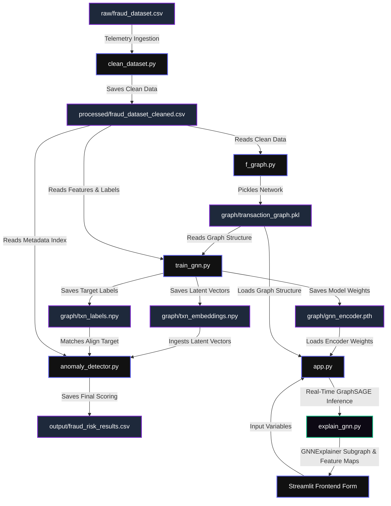

# UPI GNN Fraud Shield: Complete Project Workflow & Execution Guide

This document provides a highly detailed walkthrough of the **AeroPay UPI Adaptive Fraud Shield** project. It outlines the codebase structure, execution instructions, algorithm details, mathematical formulations, and runtime pipelines.

---

## 1. Project Directory & Key Files

The codebase is organized as follows:

* **Data Directories:**
  * Raw input logs: `data/raw/fraud_dataset.csv`
  * Preprocessed logs: [fraud_dataset_cleaned.csv](file:///c:/Users/Administrator/OneDrive/Desktop/fraud-detection-gnn/data/processed/fraud_dataset_cleaned.csv)
  * Network graph structure: [transaction_graph.pkl](file:///c:/Users/Administrator/OneDrive/Desktop/fraud-detection-gnn/data/graph/transaction_graph.pkl)
  * Saved transaction latent embeddings: `data/graph/txn_embeddings.npy`
  * Ground-truth labels for embeddings: `data/graph/txn_labels.npy`
  * PyTorch GNN encoder model checkpoint: `data/graph/gnn_encoder.pth`

* **Source Code (`src/`):**
  * **Data Cleaning & Pipeline Prep:** [clean_dataset.py](file:///c:/Users/Administrator/OneDrive/Desktop/fraud-detection-gnn/src/preprocess/clean_dataset.py)
  * **Graph Construction:** [f_graph.py](file:///c:/Users/Administrator/OneDrive/Desktop/fraud-detection-gnn/src/graph/f_graph.py)
  * **GNN Representation Training:** [train_gnn.py](file:///c:/Users/Administrator/OneDrive/Desktop/fraud-detection-gnn/src/graph/train_gnn.py)
  * **Explainable AI (GNNExplainer):** [explain_gnn.py](file:///c:/Users/Administrator/OneDrive/Desktop/fraud-detection-gnn/src/graph/explain_gnn.py)
  * **Unsupervised Anomaly Classifier:** [anomaly_detector.py](file:///c:/Users/Administrator/OneDrive/Desktop/fraud-detection-gnn/src/anomaly_detection/anomaly_detector.py)
  * **Interactive Streamlit Web Dashboard:** [app.py](file:///c:/Users/Administrator/OneDrive/Desktop/fraud-detection-gnn/src/app.py)

* **Web Front-End Interfaces (`web/` & root):**
  * **Dashboard Launcher:** [run_web_app.py](file:///c:/Users/Administrator/OneDrive/Desktop/fraud-detection-gnn/run_web_app.py)
  * **Static Web Assets:** [index.html](file:///c:/Users/Administrator/OneDrive/Desktop/fraud-detection-gnn/web/index.html) | [styles.css](file:///c:/Users/Administrator/OneDrive/Desktop/fraud-detection-gnn/web/styles.css) | [script.js](file:///c:/Users/Administrator/OneDrive/Desktop/fraud-detection-gnn/web/script.js)

* **Visualizations & Evaluation Tools (`visualizations/`):**
  * **Performance Metric Plotter:** [accuracy_graph.py](file:///c:/Users/Administrator/OneDrive/Desktop/fraud-detection-gnn/visualizations/accuracy_graph.py)
  * **Individual Feature Plotter:** [generate_individual_plots.py](file:///c:/Users/Administrator/OneDrive/Desktop/fraud-detection-gnn/visualizations/generate_individual_plots.py)
  * **Thesis Panel Generator:** [generate_thesis_panels.py](file:///c:/Users/Administrator/OneDrive/Desktop/fraud-detection-gnn/visualizations/generate_thesis_panels.py)

---

## 2. End-to-End Execution Guide

To run the complete data processing, training, evaluation, and user interface lifecycle, execute the following commands in order inside your Windows PowerShell terminal.

### Step 2.1: Data Preprocessing
Ingests raw transaction data, resolves missing variables, encodes category types, strips out label leakage columns, and saves the cleaned dataset.
```powershell
python src/preprocess/clean_dataset.py
```

### Step 2.2: Heterogeneous Graph Construction
Compiles the cleaned dataset into an undirected NetworkX graph, mapping transactions, users, devices, and merchants as nodes, and establishes device-sharing edges.
```powershell
python src/graph/f_graph.py
```

### Step 2.3: Graph Neural Network Representation Training
Trains the unsupervised GraphSAGE model on the graph structure using negative sampling-based link prediction.
```powershell
python src/graph/train_gnn.py
```

### Step 2.4: Anomaly Detection Evaluation & Calibrated Scoring
Fits the unsupervised Isolation Forest on the 64-dimensional GraphSAGE embeddings, generates risk scoring, and outputs performance logs.
```powershell
python src/anomaly_detection/anomaly_detector.py
```

### Step 2.5: Launch the Streamlit GNN Inference Dashboard
Launches the interactive real-time telemetry dashboard inside your web browser.
```powershell
streamlit run src/app.py
```

### Step 2.6: Launch the Web App Server
Launches a lightweight web server on `http://localhost:8000` to serve the static frontend interface.
```powershell
python run_web_app.py
```

---

## 3. Comprehensive Pipeline Workflow & Architecture



---

## 4. Deep-Dive Module Walkthroughs

### 4.1. Data Preprocessing & Cleaning (`clean_dataset.py`)
This script cleans the UPI payment logs. To avoid training an artificial GNN that bypasses structural patterns, the script isolates and removes features that perfectly track the label.

* **Target Leakage Columns Removed:**
  * `handle_verification_status` (since `unverified` maps perfectly to fraud).
  * `business_name_match` (since `none` matches fraud).
  * `unusual_transaction_amount_flag`, `time_pressure_indicators`, and `otp_request_device_consistency`.
  * `merchant_category_code`, `handle_registration_pattern`, and `pin_entry_method`.
* **Zero-Variance & High-Missing Fields Removed:**
  * Zero-variance columns: `upi_handle_age`, `relationship_to_requester`, `social_media_presence`, and `handle_contains_official_terms`.
  * High-missing columns (>95% null): `url_referrer` and `request_description`.
  * Free-text coordinates/addresses: `description`, `ip_address`, and `location`.
* **Feature Engineering:**
  * String lists like `permissions_granted` or `recognized_screen_sharing_apps` are converted into binary flag vectors ($1$ if populated, $0$ if empty).
  * Time variables formatting (`MM:SS.s`) are parsed into numerical representations (`timestamp_seconds`).
  * One-hot encodes category metrics: `session_source`, `authorization_method`, `transaction_type`, and `handle_typo_analysis`.

---

### 4.2. Relational Graph Construction (`f_graph.py`)
Uses the NetworkX library to project data points into relational space. It constructs an undirected graph containing transaction nodes and entity relationships.

* **Node Entities Created:**
  * **Transactions:** Explicit nodes mapped using the original transaction UUID.
  * **Entities:** Connected neighbor nodes containing user IDs, merchant IDs, and device IDs.
* **Edge Structures Established:**
  * Connects `transaction_id` to its respective `user_id`, `merchant_id`, and `device_id`.
  * **Shared-Device Fraud Rings:** Computes a device grouping (`df.groupby('device_id')`). If a single device ID processes transactions for more than one user ID, an edge is created between those users to signal a coordinated device-sharing ring.

---

### 4.3. Unsupervised GNN Training (`train_gnn.py`)
Trains the spatial Graph Neural Network (GraphSAGE) to aggregate local neighborhoods and generate embeddings.

* **GraphSAGE Architecture:**
  * Uses two layers of `SAGEConv` (GraphSAGE convolution) with batch normalization and an Exponential Linear Unit (`ELU`) activation function:
  
    $$h_{\mathcal{N}(v)}^{(k)} = \text{AGGREGATE}_k \left( \left\{ h_u^{(k-1)}, \forall u \in \mathcal{N}(v) \right\} \right)$$
    
    $$h_v^{(k)} = \text{ELU} \left( \mathbf{W}^{(k)} \cdot \left[ h_v^{(k-1)} \,\|\, h_{\mathcal{N}(v)}^{(k)} \right] \right)$$
    
  * Layer 1 maps features to $128$ hidden dimensions, followed by a $30\%$ dropout layer.
  * Layer 2 projects inputs to a $64$-dimensional embedding.
* **Self-Supervised Link Prediction Optimizer:**
  * Because fraud tags are not used in training, the network updates its weights using negative sampling link prediction.
  * **Positive Loss:** Minimizes distance between connected neighboring nodes:
  
    $$\mathcal{L}_{\text{pos}} = - \log \sigma \left( z_{\text{src}} \cdot z_{\text{dst}} \right)$$
    
  * **Negative Loss:** Accentuates distance between unconnected nodes generated using negative sampling:
  
    $$\mathcal{L}_{\text{neg}} = - \log \left( 1 - \sigma \left( z_{\text{neg\_src}} \cdot z_{\text{neg\_dst}} \right) \right)$$
    
  * The objective is to minimize: $\mathcal{L}_{\text{total}} = \mathcal{L}_{\text{pos}} + \mathcal{L}_{\text{neg}}$.

---

### 4.4. Anomaly Isolation and Risk Score Engine (`anomaly_detector.py`)
Identifies transaction anomalies and computes risk metrics using scikit-learn.

* **Classifier Configuration:**
  * Fits an **Isolation Forest** ensemble ($300$ isolation trees) with the target contamination rate set to $0.16$.
* **Risk Score Calibration:**
  * Calculates a raw isolation score (path length output) for each GNN embedding vector $x$ using `decision_function(x)`.
  * Normalizes and scales the decision value to return a calibrated risk metric from $0\%$ to $100\%$:
  
    $$\text{Risk Score} = 100 \times \left( 1 - \frac{s_x - \min(S)}{\max(S) - \min(S)} \right)$$
    
    where $s_x$ is the raw decision score of the transaction, and $S$ is the set of all decision scores.
  * Any score exceeding $70\%$ is flagged as "Blocked", while transactions below are marked "Allowed".

---

### 4.5. Real-Time Explainable AI Engine (`explain_gnn.py`)
Computes feature and graph pathway explanations.

* **GNNExplainer Subgraph Generation:**
  * Integrates PyTorch Geometric's `GNNExplainer` to optimize edge masks ($M_e$) and feature masks ($M_f$) to maximize the mutual information of the target node projection:
  
    $$\max_{G_s, X_s} \text{MI} \left( Y, \hat{Y}(G_s, X_s) \right)$$
    
  * Extracts the local neighborhood subgraph around the target transaction node, sorting edge and feature masks to identify which factors drove the anomaly.
* **Statistical Feature Deviation (Local XAI):**
  * Computes standard deviation ($\sigma$) offsets against a clean cluster baseline:
  
    $$z_i = \frac{x_i - \mu_{i,\text{safe}}}{\sigma_{i,\text{safe}}}$$
    
    $$\text{Influence Score}(i) = z_i^2$$
    
  * Identifies the primary drivers (e.g. transaction speed, amount, or remote screen control status) behind an anomalous classification.

---

### 4.6. Streamlit User Interface (`app.py`)
Streamlit provides a frontend interface for testing and analysis:

1. **Input Interface:** Users input parameters (e.g. transaction amount, device UUID, remote screen share checkbox, and User ID).
2. **Strict Regex Validation:**
   * User ID must match `^user_[A-Za-z0-9_]+$`.
   * Device ID must match a standard 36-character UUID pattern.
3. **Dynamic Latent Space Inference:**
   * Maps new input nodes into the GNN space, computes neighborhood edges, and outputs the GNN score.
   * Verdict cards flash green (**ALLOWED**) or red (**BLOCKED**) based on the $70\%$ threshold.
4. **Interactive GNNExplainer Charts:**
   * **GNN Decision Subgraph:** Uses NetworkX to plot the neighborhood nodes, with edge thickness representing GNNExplainer influence scores.
   * **GNN Feature Influence:** Displays a horizontal bar chart showing the top 5 feature weights computed during GNNExplainer mask optimization.
5. **Ledger Synced:** Appends newly simulated entries to `processed/fraud_dataset_cleaned.csv` to keep the database updated.
